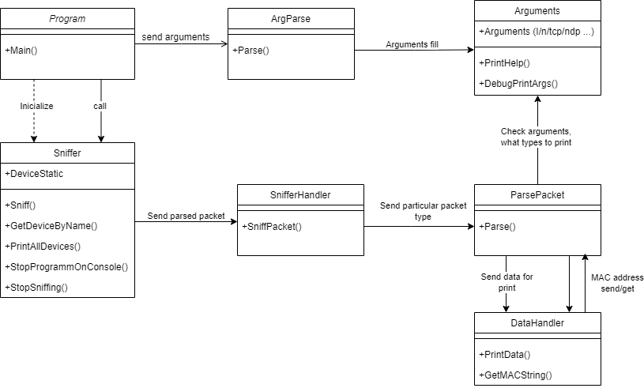

# IPK-second-project-2024

## Table of Contents

- [Executive Summary](#executive-summary)
- [Introduction](#introduction)
- [Theoretical Background](#theoretical-background)
- [Project Architecture and Design](#project-architecture-and-design)
- [Tools Used](#tools-used)
- [Testing](#testing)
- [Bibliography](#bibliography)

## Executive Summary
This project, **ipk-sniffer** aims to develop a robust client application enabling user to 'sniff' all the packets coming through chosen interface. The primary objective was to create an efficient client that 'sniffs' type of packets, according to specification given through program arguments to either 'sniff' all types of packets (no type arguments specified) or particular ones (such as only those which use tcp/udp protocols etc.)
## Introduction
This project is focused on development of a sniffer that detects and prints network packets using given specification
## Theoretical Background
The development of the ipk-sniffer application centers around creating an efficient means of network 'sniffing'.   

A **sniffer** is a software or hardware tool that allows the user to 'sniff' or monitor your internet traffic in real time, capturing all the data flowing to and from your computer.  

There are different types of IP packets:
- **UDP** is an unreliable transport system used to transfer data between machines. When data is sent, the only thing that is guaranteed is the packet was sent out on the wire.
- **TCP** is a reliable transport system. When data is sent, it is guaranteed the remote host will get the data.
- **ICMP** is a protocol used to send control and error information between hosts. Error messages include destination unreachable (address specified in message does not exist), parameter problem (one of the fields in a message was invalid), etc. 
- **IGMP** is a protocol which provides multicast router information about multicast addresses on a network. This allows the multicast router to forward multicast packets to remote networks.
## Project Architecture and Design
### Project Architecture
The client application is structured around a modular architecture, dividing all tasks between couple of key classes, which was operating with wide variety of methods and functions. _(Some descriptions are generalized in order to reader for better understanding inner code structure, for example if it is being said that class performs some action, it means that most\all functions in this class are aimed to accomplish this task)_
- `Program:` core class, where **Main** method is situated , from which program starts and where all arguments are sent to parse in corresponding class. Creates instance of sniffer class and starts core _sniff_ function.
- `Arguments:` custom class, where all the arguments are stored.
- `ArgParse:` custom class, where all incoming arguments are being parsed into `Arguments` static class.
- `Sniffer:` core class, where is situated big part of application logic. Either prints list of interfaces available or gets specified interface , which later opens for reading packets. Subscribe `SnifferHandler` on packet arrival event. 
- `SnifferHandler:` custom class, where packet is being extracted and sent to parse.
- `ParsePacket:` core class, where packet is being parsed and printed for user`s view.
- `Packets:` custom class, in which instance packet will be stored distributed in according type.
- `DataHandler:` custom class, where some helping methods are situated.

### Project design
I designed UML diagram you can see below, to more clearly demonstrate relations between all of created classes.

## Tools Used
The client was developed on an Asus laptop, with Windows 10 operating system installed. Also in the development was involved virtual machine linux-x64 Ubuntu.  
### Key tools used

**Python3:** For Semi-Automated Testing.

**.NET 8+ SDK:** Provides the runtime and libraries for building the application, along with tools for compilation and package management.

**JetBrains Rider:** Served as the primary IDE.

**Git and Gitea:** Version control and repository hosting.

## Testing
### Preface 
Most of the tests was handled in _Python3_ language half-manually (all packets was designed independently and for certain test-case). Some of them however was handled by NetCat tool (Ubuntu).  
Also, despite the fact that not all the test-cases are pictured here, those which are, takes a lot of space due to the packet print view.
### Tests 
___ 
**NetCat testing**  
**TEST OBJECTIVE:** TCP packet read check  
**INPUT:** "Test of TCP packet"  
**EXPECTED OUTPUT:** 
``` 
timestamp :2024-04-22T:17:58:56.601+00:00

frame length: 87 bytes

src IP: 127.0.0.1

dst IP: 127.0.0.1

src port: 37502

dst port: 35454

00000000 : 00 00 03 04 00 06 00 00 00 00 00 00 00 00 08 00 ................
00000010 : 45 00 00 47 65 AC 40 00 40 06 D7 02 7F 00 00 01 E..Ge¬@.@.×.....
00000020 : 7F 00 00 01 92 7E 8A 7E 06 CE DF 37 19 AE 97 E4 .....~.~.Îß7.®.ä
00000030 : 80 18 02 00 FE 3B 00 00 01 01 08 0A 94 2C D7 35 ....þ;.......,×5
00000040 : 94 2B 68 6E 54 65 73 74 20 6F 66 20 54 43 50 20 .+hnTest of TCP
00000050 : 70 61 63 6B 65 74 0A                            packet. 
```  
**OUTPUT:** 
```
timestamp :2024-04-22T:17:58:56.601+00:00

frame length: 87 bytes

src IP: 127.0.0.1

dst IP: 127.0.0.1

src port: 37502

dst port: 35454

00000000 : 00 00 03 04 00 06 00 00 00 00 00 00 00 00 08 00 ................
00000010 : 45 00 00 47 65 AC 40 00 40 06 D7 02 7F 00 00 01 E..Ge¬@.@.×.....
00000020 : 7F 00 00 01 92 7E 8A 7E 06 CE DF 37 19 AE 97 E4 .....~.~.Îß7.®.ä
00000030 : 80 18 02 00 FE 3B 00 00 01 01 08 0A 94 2C D7 35 ....þ;.......,×5
00000040 : 94 2B 68 6E 54 65 73 74 20 6F 66 20 54 43 50 20 .+hnTest of TCP
00000050 : 70 61 63 6B 65 74 0A                            packet. 
```  
___   
**NetCat testing**  
**TEST OBJECTIVE:** UDP packet read check  
**INPUT:** "Test of UDP packet"  
**EXPECTED OUTPUT:** 
``` 
timestamp :2024-04-22T:18:06:04.368+00:00

frame length: 63 bytes

src IP: 127.0.0.1

dst IP: 127.0.0.1

src port: 55355

dst port: 35454

00000000 : 00 00 03 04 00 06 00 00 00 00 00 00 00 00 08 00 ................
00000010 : 45 00 00 2F 5F BE 40 00 40 11 DC FD 7F 00 00 01 E../_¾@.@.Üý....
00000020 : 7F 00 00 01 D8 3B 8A 7E 00 1B FE 2E 54 65 73 74 ....Ø;.~..þ.Test
00000030 : 20 6F 66 20 55 44 50 20 70 61 63 6B 65 74 0A     of UDP packet. 
```  
**OUTPUT:** 
```
timestamp :2024-04-22T:18:06:04.368+00:00

frame length: 63 bytes

src IP: 127.0.0.1

dst IP: 127.0.0.1

src port: 55355

dst port: 35454

00000000 : 00 00 03 04 00 06 00 00 00 00 00 00 00 00 08 00 ................
00000010 : 45 00 00 2F 5F BE 40 00 40 11 DC FD 7F 00 00 01 E../_¾@.@.Üý....
00000020 : 7F 00 00 01 D8 3B 8A 7E 00 1B FE 2E 54 65 73 74 ....Ø;.~..þ.Test
00000030 : 20 6F 66 20 55 44 50 20 70 61 63 6B 65 74 0A     of UDP packet.
```  
___   
**Python testing**  
**TEST OBJECTIVE:** IcmpV4 packet sent  
**INPUT:** packet containing information : IP(dst="127.0.0.1") / ICMP()  
**EXPECTED OUTPUT:** 
```
timestamp :2024-04-22T:18:11:53.095+00:00

frame length: 44 bytes

src IP: 127.0.0.1

dst IP: 127.0.0.1

00000000 : 00 02 03 04 00 06 00 00 00 00 00 00 65 72 08 00 ............er..
00000010 : 45 00 00 1C 00 01 00 00 40 01 7C DE 7F 00 00 01 E.......@.|Þ....
00000020 : 7F 00 00 01 08 00 F7 FF 00 00 00 00             ......÷ÿ....
```
**OUTPUT:** 
```
timestamp :2024-04-22T:18:11:53.095+00:00

frame length: 44 bytes

src IP: 127.0.0.1

dst IP: 127.0.0.1

00000000 : 00 02 03 04 00 06 00 00 00 00 00 00 65 72 08 00 ............er..
00000010 : 45 00 00 1C 00 01 00 00 40 01 7C DE 7F 00 00 01 E.......@.|Þ....
00000020 : 7F 00 00 01 08 00 F7 FF 00 00 00 00             ......÷ÿ....
```  
___   
**TEST OBJECTIVE:** Arg parse error check  
**INPUT:** "sudo ./ipk-sniffer -i example"  in command line  
**EXPECTED OUTPUT:** "Such interface not found!"    
**OUTPUT:** "Such interface not found!"   
___   
##### There are not all of the tests, which were done, because the actual number of tests would take too much space.
## Bibliography
- 20 Avast | Avast Academy [online]. (2024) Link : https://www.avast.com/c-sniffer
- 23 OnTime | REAL-TIME AND SYSTEM SOFTWARE [online]. (2024) Link :http://www.on-time.com/rtos-32-docs/rtip-32/programming-manual/tcp-ip-networking/ip-packet-types.htm